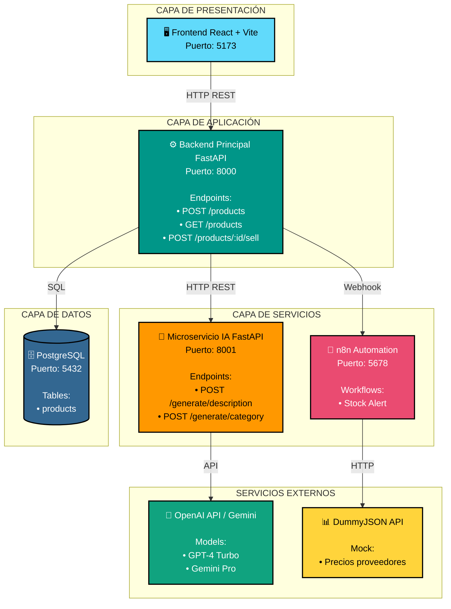
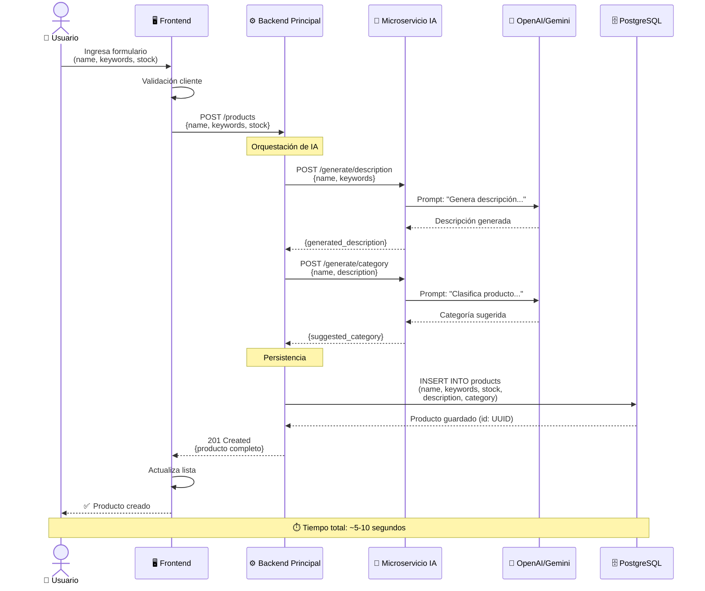
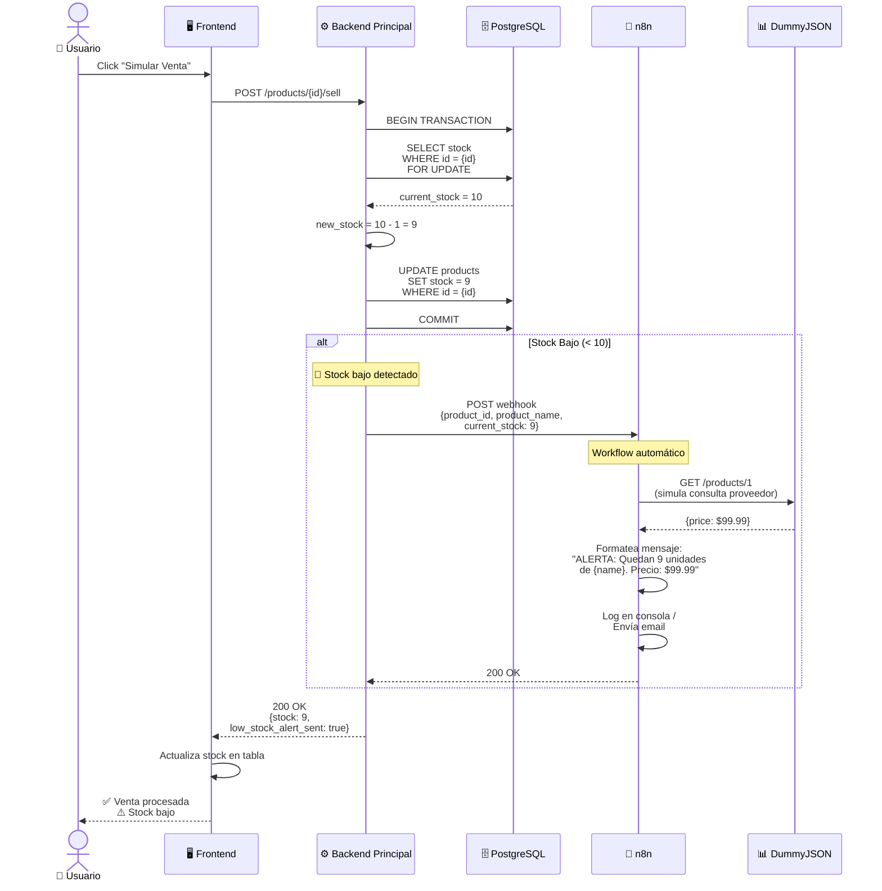
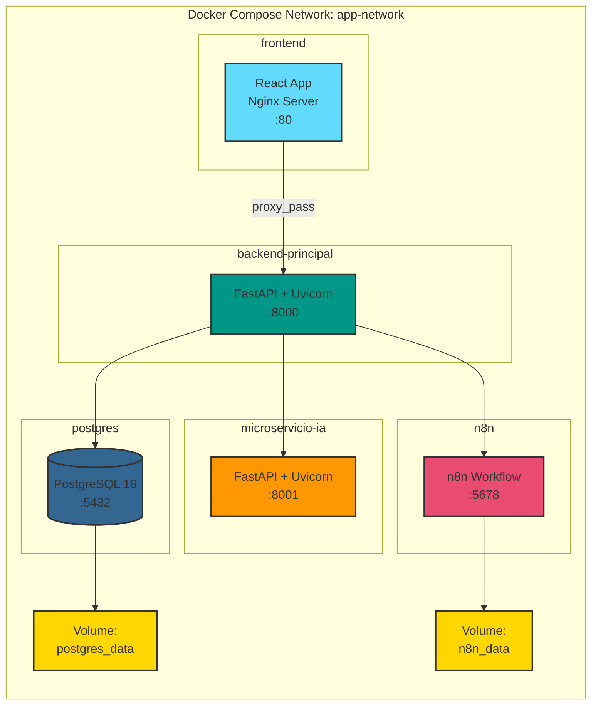
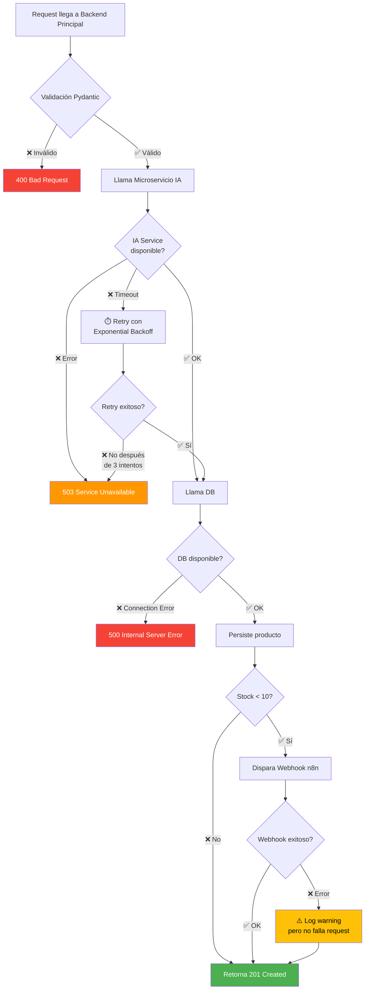
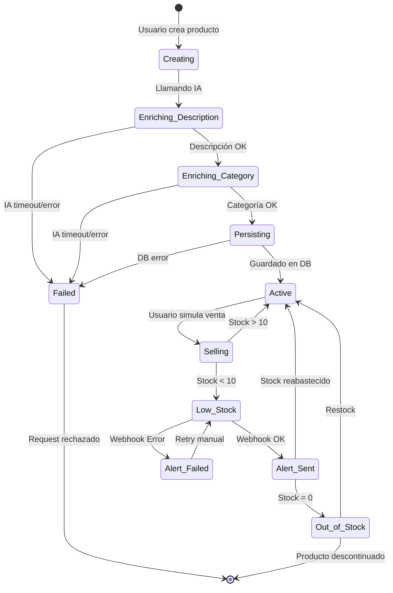
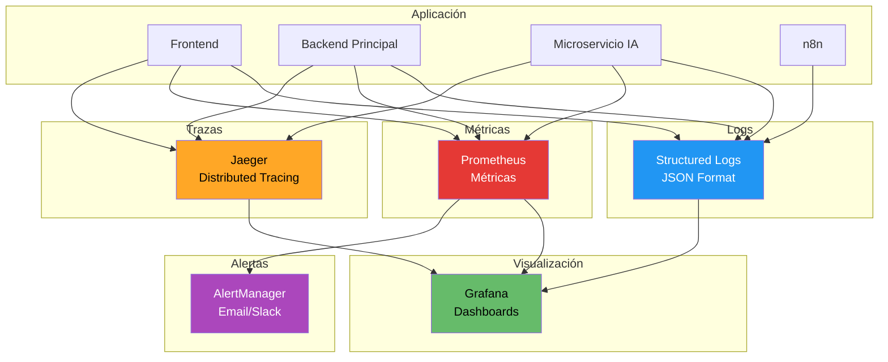

# Diagramas de Arquitectura

## 📐 Diagrama de Arquitectura del Sistema



## 🔄 Diagrama de Flujo: Crear Producto



## 💰 Diagrama de Flujo: Simular Venta y Alerta



## 🏗️ Diagrama de Contenedores Docker



## 🗄️ Diagrama de Modelo de Datos

```mermaid
erDiagram
    PRODUCTS {
        uuid id PK "Primary Key (UUID v4)"
        varchar name "Nombre del producto (max 200)"
        jsonb keywords "Array de palabras clave"
        integer stock "Stock actual (>= 0)"
        text description "Descripción generada por IA"
        varchar category "Categoría IA (formato: A > B > C)"
        timestamp created_at "Fecha de creación"
        timestamp updated_at "Última actualización"
    }

    PRODUCTS ||--o{ STOCK_ALERTS : "triggers"
    
    STOCK_ALERTS {
        uuid id PK "Primary Key"
        uuid product_id FK "Referencia a producto"
        integer stock_level "Stock cuando se disparó"
        timestamp triggered_at "Momento de la alerta"
        boolean webhook_sent "Si se envió a n8n"
    }

    note "Índices:
    - idx_products_stock (para queries de stock bajo)
    - idx_products_category (para filtros futuros)
    - idx_products_created_at (para ordenamiento)"
```

## 🔐 Diagrama de Manejo de Errores



## 📊 Diagrama de Estados del Producto



## 🚀 Diagrama de Deployment

```
┌─────────────────────────────────────────────────────────────────┐
│                         HOST MACHINE                             │
│                     (Docker Host - Linux)                        │
├─────────────────────────────────────────────────────────────────┤
│                                                                  │
│  ┌────────────────────────────────────────────────────────┐    │
│  │           Docker Compose (app-network)                  │    │
│  │                                                          │    │
│  │  ┌──────────────┐  ┌──────────────┐  ┌─────────────┐  │    │
│  │  │   Frontend   │  │   Backend    │  │ Microservice│  │    │
│  │  │    :5173     │◄─┤   :8000      │◄─┤ IA :8001    │  │    │
│  │  └──────────────┘  └──────┬───────┘  └──────┬──────┘  │    │
│  │                           │                  │          │    │
│  │                           │                  │          │    │
│  │  ┌──────────────┐  ┌──────▼───────┐  ┌─────▼──────┐  │    │
│  │  │     n8n      │◄─┤  PostgreSQL  │  │  OpenAI    │  │    │
│  │  │    :5678     │  │   :5432      │  │   API      │  │    │
│  │  └──────────────┘  └──────────────┘  └────────────┘  │    │
│  │         │                 │                  │         │    │
│  │         │                 │                  │         │    │
│  │  ┌──────▼──────┐   ┌──────▼───────┐         │         │    │
│  │  │ n8n_data    │   │postgres_data │         │         │    │
│  │  │  (volume)   │   │   (volume)   │         │         │    │
│  │  └─────────────┘   └──────────────┘         │         │    │
│  │                                              │         │    │
│  └──────────────────────────────────────────────┼─────────┘    │
│                                                 │              │
│                                                 │ HTTPS        │
│                                                 ▼              │
│                                        ┌──────────────────┐    │
│                                        │ External Service │    │
│                                        │  (OpenAI/Gemini) │    │
│                                        └──────────────────┘    │
│                                                                 │
│  ┌──────────────────────────────────────────────────────────┐ │
│  │               Puertos Expuestos al Host:                  │ │
│  │  • 5173 → Frontend (desarrollo)                          │ │
│  │  • 80   → Frontend (producción)                          │ │
│  │  • 8000 → Backend Principal                              │ │
│  │  • 8001 → Microservicio IA                               │ │
│  │  • 5678 → n8n UI                                         │ │
│  │  • 5432 → PostgreSQL (solo para debug)                   │ │
│  └──────────────────────────────────────────────────────────┘ │
└─────────────────────────────────────────────────────────────────┘
```

## 📈 Diagrama de Monitoreo y Observabilidad (Futuro)



## 🔑 Leyenda de Iconos

| Icono | Significado |
|-------|-------------|
| 🖥️ | Frontend / UI |
| ⚙️ | Backend / API |
| 🤖 | Servicio IA / ML |
| 🔄 | Automatización / Workflow |
| 🗄️ | Base de Datos |
| 🧠 | LLM / IA Externa |
| 📊 | API Mock / Testing |
| 👤 | Usuario Final |
| 🚨 | Alerta / Notificación |
| ⏱️ | Timeout / Retry |
| ✅ | Éxito / OK |
| ❌ | Error / Fallo |
| ⚠️ | Warning / Degradado |

---

**Nota**: Para visualizar los diagramas Mermaid, puedes usar:
- GitHub (renderiza automáticamente en README.md)
- VS Code con extensión "Markdown Preview Mermaid Support"
- Mermaid Live Editor: https://mermaid.live/
- Herramientas de documentación como Docusaurus, GitBook, etc.
