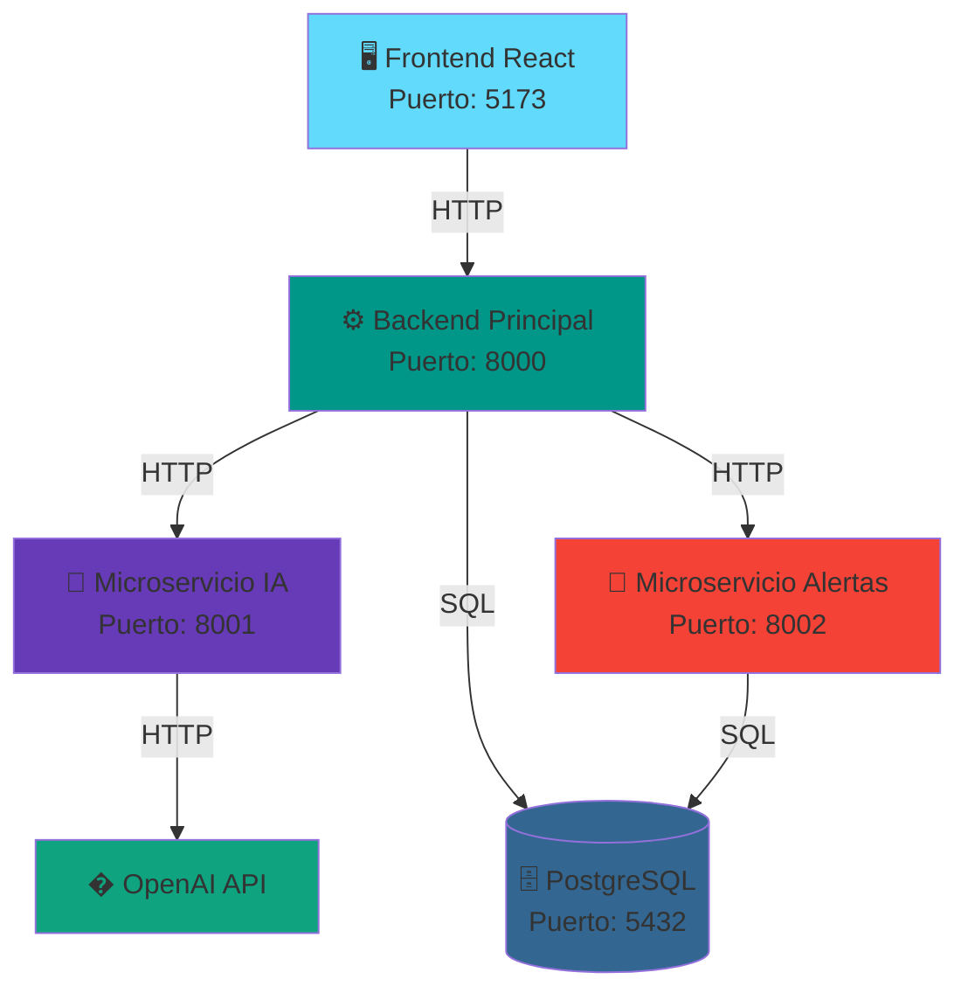
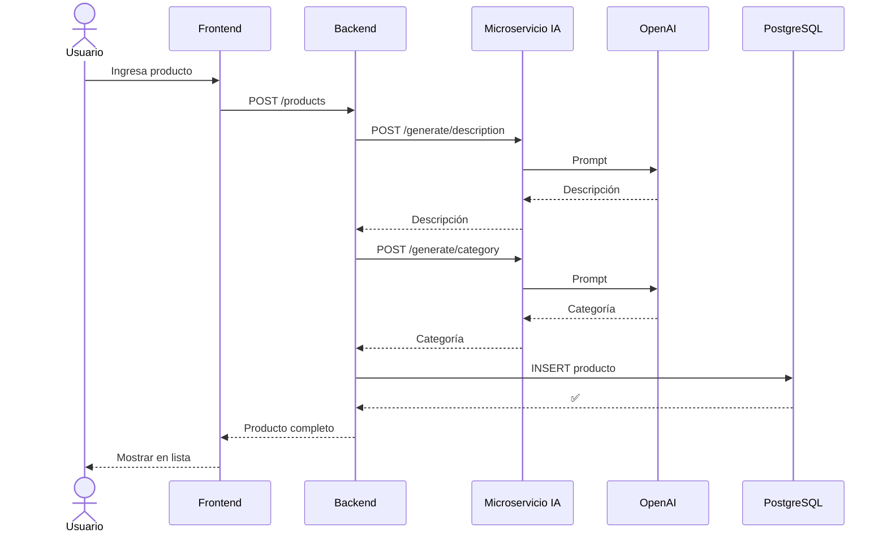
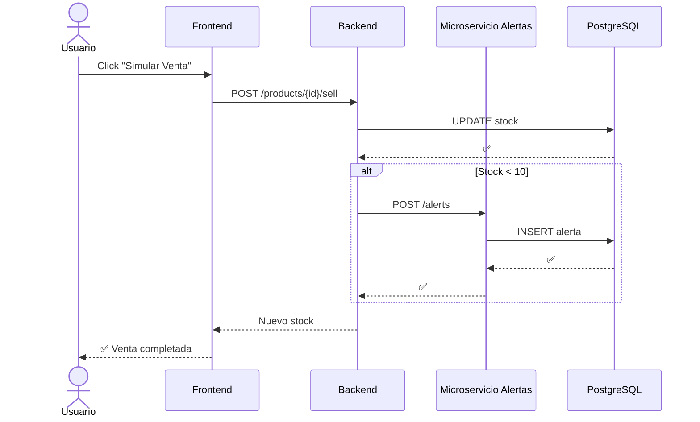

# 📊 Diagramas de Arquitectura

## 🏗️ Sistema Completo



## 🔄 Crear Producto



## 🚨 Venta y Alerta de Stock



## 🐳 Docker Compose

```
docker-compose.yml
├── frontend (React)              :5173 / :80
├── backend-principal (FastAPI)   :8000
├── microservicio-ia (FastAPI)    :8001
├── microservicio-alertas (FastAPI) :8002
└── postgres                      :5432
```

## � Base de Datos

```
Tabla: products
├── id (UUID)
├── name (string)
├── keywords (array)
├── stock (int)
├── description (text - generado por IA)
├── category (string - generado por IA)
├── created_at
└── updated_at
```

## �️ Manejo de Errores

| Error | Acción |
|-------|--------|
| Validación Pydantic ❌ | 400 Bad Request |
| OpenAI timeout ⏱️ | Retry (3x exponencial) → 503 |
| DB error 🗄️ | 500 Internal Server Error |
| Alerta fallida ⚠️ | Log warning (no falla request) |

## � Timeouts Configurados

| Servicio | Timeout | Razón |
|----------|---------|-------|
| OpenAI API | 30s | LLM puede tardar |
| PostgreSQL | 5s | Queries rápidas |
| Reintentos | 3x con backoff | 1s → 2s → 4s |

---

**Última actualización**: 2025-11-08  
**Versión**: 1.0.0
